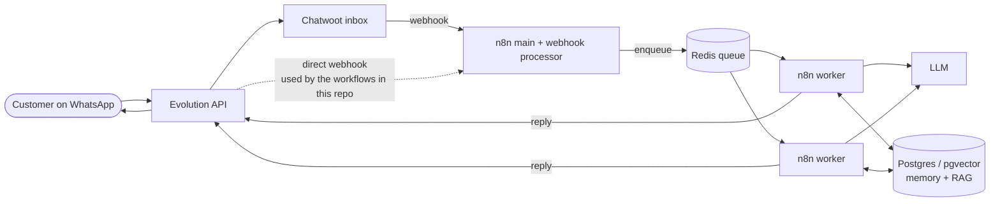

# AI Automation Portfolio

Sanitized examples of production AI automations built by **Leonardo Lima Chaves**: WhatsApp-first conversational agents orchestrated in n8n, backed by a RAG knowledge base, human-takeover controls, follow-up cadences and lead reporting.

> **These are sanitized examples, not drop-in exports.** They were exported (read-only) from real n8n instances and then passed through an automated sanitizer plus a manual review. All credentials, internal ids, webhook ids, URLs/hosts, phone numbers, group ids, e-mails, tokens, client names and business rules were removed or replaced with neutral placeholders (`Client A`, `Product A`, `https://example.invalid`, `PLACEHOLDER_ID`...). Agent prompts were **rewritten as generic skeletons**; the original client prompts and knowledge-base content are not included. Import them to study the architecture, not to run them as-is.

## What is in here

| Path | Description |
|------|-------------|
| [`workflows/01-support-agent-whatsapp-rag.json`](workflows/01-support-agent-whatsapp-rag.json) | Multi-agent WhatsApp support/qualification agent with a router, specialist agents, RAG, media tools, follow-ups and lead reports. [Notes](workflows/01-support-agent-whatsapp-rag.md) |
| [`workflows/02-enrollment-agent-whatsapp-rag-scheduling.json`](workflows/02-enrollment-agent-whatsapp-rag-scheduling.json) | Enrollment/sales agent with scheduling tools, a contract-link follow-up cadence, a Drive-to-vector-store RAG training pipeline and media delivery. [Notes](workflows/02-enrollment-agent-whatsapp-rag-scheduling.md) |
| [`docs/ai-ops-workflow.md`](docs/ai-ops-workflow.md) | The human-in-the-loop process used to plan, execute and validate changes with AI assistants. |

## Stack

- **n8n in queue mode** — a main instance, dedicated webhook processor(s) and workers sharing Redis (queue) and Postgres (state), so inbound WhatsApp bursts are absorbed by the queue rather than by the editor process.
- **Evolution API** — WhatsApp gateway (the exports also contain an optional WAHA path behind a normalizer node).
- **Chatwoot** — omnichannel inbox and human-handoff surface in the wider platform.
- **LLMs** — OpenAI chat models for agents and chains, Whisper-style audio transcription, vision for images; the agent nodes are provider-swappable.
- **Postgres / Supabase (pgvector)** — chat memory, conversation tables and the RAG vector store (`match_documents`).
- **Redis** — message debounce buffer (merge bursts of short messages into one turn).

## Architecture

The two workflows published here receive the Evolution API webhook directly; the Chatwoot hop is part of the broader platform and is not included in these exports.

## Reference flow (shared by both workflows)

1. **Ingest** — webhook receives the WhatsApp event; a normalizer resolves the real sender identity (including the `@lid` to phone mapping) and builds a canonical `Dados` record (text / audio / image).
2. **Guard rails** — ignore groups and own messages, detect a *human takeover* (agent replies from the phone pause the AI and keep saving history) and a keyword that re-activates it.
3. **Debounce** — messages are pushed to a Redis list, the flow waits, re-reads the list and only the last execution proceeds (merging bursts into one turn).
4. **Media** — audio is transcribed, images are described, and the result is merged into the same turn.
5. **Route** — an LLM router decides which specialist agent should answer (per offer, or commercial next-step).
6. **Answer** — the specialist agent uses a *think* tool, a RAG tool, media tools and (workflow 02) scheduling tools, with Postgres chat memory.
7. **Deliver** — an LLM chain splits the answer into at most three WhatsApp-sized messages; media markers are extracted and sent as image/video.
8. **Persist & report** — history is stored, closed conversations trigger an LLM lead report posted to an internal group.
9. **Follow-up** — a scheduler scans idle chats and sends capped, LLM-written nudges.

## What was sanitized

Categories only (no original values are published): credential blocks and credential ids; workflow/instance/webhook ids; node ids; URLs, hosts and Drive/document ids; API keys, bearer/JWT tokens and header secrets; phone numbers, WhatsApp JIDs and group ids; e-mail addresses; person, client and product names; client-specific business rules, prices, addresses and regions; internal task/ticket references in code comments; pinned data and static data; cached resource names and links. See the per-workflow notes for the manual-review items.

## License / use

Shared as a portfolio. Not licensed for reuse of the original client content (which is not included).
